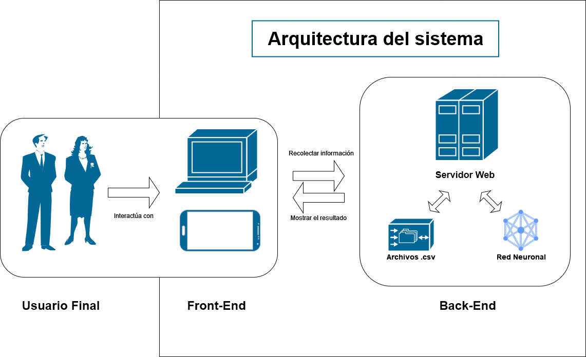
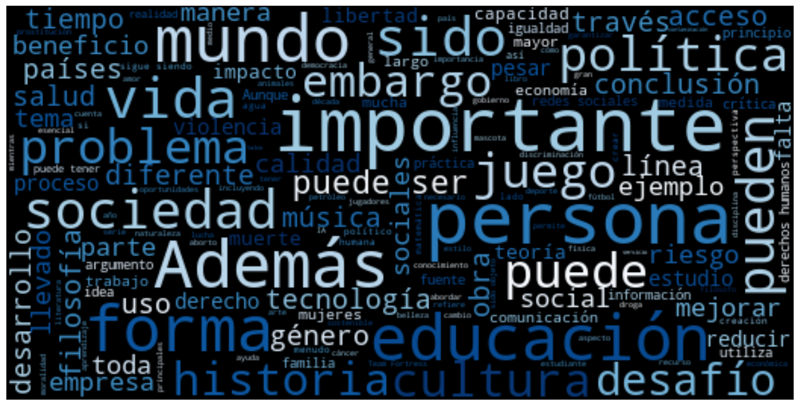
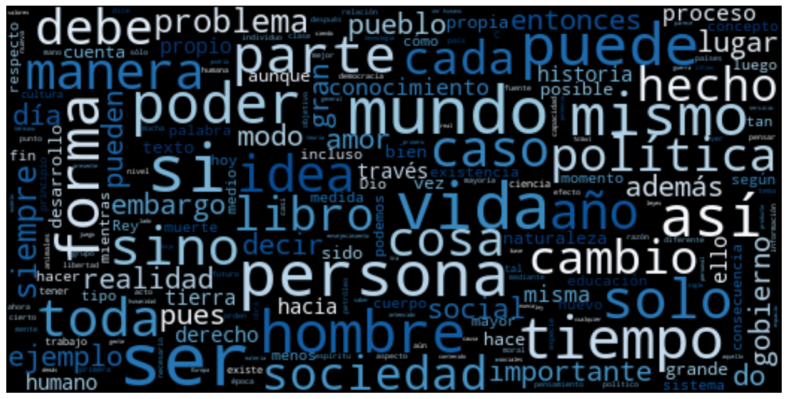
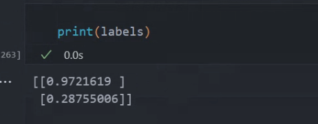

# GPT DETECTIVE
## Desarrollo del Prototipo de Negocio
### Redes Neuronales Artificiales y Algoritmos Bio-Inspirados

#### Equipo 2

Integrantes:
- Felipe Miranda Arboleda 1000099237
- Emilio Porras Mejía 1001418000
- Esteban García Carmona 1000409207

Profesor:
Juan David Ospina Arango

Universidad Nacional de Colombia sede Medellín
Facultad de Minas
Medellín, Colombia
Junio 2023

## Introducción

Este reporte técnico presenta el funcionamiento de un prototipo que soluciona la problemática del abuso de la inteligencia artificial para la generación de texto, mencionado en García et al [1]. Este problema se ha convertido en un desafío para las entidades educativas y empleadores que buscan detectar el plagio en los trabajos entregados. En este sentido, se propone una solución basada en el uso de redes neuronales que permiten el análisis del lenguaje y la estructura de un texto generado por inteligencia artificial, con el objetivo de identificar patrones únicos de ChatGPT. El modelo resultante será de fácil uso y permitirá obtener un producto de trabajo expandible y posiblemente preciso, que ayudará a garantizar la originalidad en los entregables.

## Análisis de requisitos del sistema

El sistema debe cumplir con los siguientes requisitos para detectar ensayos generados por ChatGPT:

1. Capacidad de procesamiento de lenguaje natural: El sistema debe ser capaz de procesar y analizar el lenguaje natural generado por ChatGPT y otros modelos de lenguaje similares.
2. Entrenamiento del modelo: Se requiere el entrenamiento de un modelo de red neuronal capaz de identificar patrones y características específicas en los textos generados por ChatGPT.
3. Facilidad de uso: El sistema debe ser fácil de usar para garantizar su adopción en diferentes contextos educativos y laborales.

## Arquitectura del sistema

La arquitectura del sistema propuesto se muestra en la figura 1. Para llegar a un producto final, que sea interactivo para el usuario y funcional en su naturaleza se debe llevar a cabo los procedimientos principales de la obtención de datos, el entrenamiento del modelo y, ya con este, la construcción del sistema web. Así, para la construcción del sistema se realizará lo siguiente:

1. Obtención y preparación de datos: Se encarga de recolectar los datos necesarios para entrenar el modelo. Estos datos consisten en textos generados por ChatGPT y textos escritos por humanos. Para que puedan ser interpretados por una red neuronal, deben ser apropiadamente etiquetados y, posteriormente, se les debe realizar un preprocesamiento que permita extraer el máximo provecho para obtener buenos resultados. Con estos datos se entrenará la red neuronal que será el modelo de predicción.

2. Entrenamiento del modelo: Se utiliza un algoritmo de aprendizaje supervisado para entrenar el modelo de red neuronal. El modelo se entrena con los datos recolectados en el componente anterior. Este modelo será adherido posteriormente al servicio web para que pueda ser utilizado a través de una interfaz gráfica por el usuario final. 

3. Una vez el back-end del modelo esté funcionando correctamente, se debe lograr generar una implementación a modo de servicio web que permita una interacción por parte del usuario. Esta debe ser clara y fácil de entender. De tal manera, el usuario final sabrá dónde montar el ensayo del que duda y será capaz de interpretar los resultados que le entregue el programa. 

_Figura 1. Diagrama de arquitectura._

## Problemáticas y ética

Existen muchas razones por las cuales puede ser deseable utilizar medios de inteligencia artificial para realizar trabajos o proyectos. En muchos casos, se desea utilizar una plantilla en la cual nos podamos basar. A la hora del desarrollo de software y en muchas otras empresas, esto se usa. Por ejemplo, si estamos desarrollando un sistema de bases de datos RESTful, no sería óptimo empezar desde 0. Sería deseable tener un código base con una idea general de lo que se intenta diseñar (que, por lo general, es de similar tipo). Del mismo modo, entra en juego la duda de si es o no justo y correcto el uso de grandes modelos de lenguaje a la hora de la redacción de proyectos o ensayos. El punto de vista que se tomó es que es correcto siempre y cuando se utilice como Cianotipo y no como trabajo final. De igual manera, antes de que estos modelos estuvieran disponibles al público, lo que se hacía era copiar y pegar de otra página web. El conocimiento se obtiene a través de un esfuerzo activo (como lo puede ser la lectura). Para realizar un trabajo, se necesita de este conocimiento. Pero eso no significa que siempre se deba de desarrollar de la manera más larga o compleja. Si se puede tener una ayuda para guiarse (especialmente conociendo todas las normas de forma y estructura que existen) debería usarse. Por lo mismo, el modelo se entrenó únicamente con textos realizados en un 100% por un modelo de lenguaje. Esto porque el problema no es ayudarse de la tecnología para crear un mejor producto (justo para esto ha sido creada) sino la pereza de algunos, evadiendo en su totalidad un esfuerzo y afectando tanto a los demás como su propio conocimiento. 

## Creación del modelo de predicción

Para la creación del modelo, primeramente, se realizó la ingeniería de datos correspondiente. Específicamente se obtuvieron 99 ensayos generados por ChatGPT de diversos temas [2] y 98 ensayos escritos por humanos [3][4][5][6]. 

Los textos generados por GPT son de "propia autoría", es decir, se le solicitó al chatbot que los generara, variando su temática y su longitud, con lo mismo, se obtuvieron las siguientes características, todo en número de caracteres:

| media | std |  min |  max |
|---|---|---|---|
|5148|1147|2626|10650|

_tabla 1: ensayos GPT_

Las temáticas y, consecuentemente, las palabras más usadas después de un leve podado se pueden observar en la siguiente _wordcloud_:

_Figura 2. GPT wordcloud._

Por otro lado, los textos humanos fueron extraídos de diferentes fuentes y páginas en búsqueda de obtener una calidad variada de temáticas y estilos. Sus características se ven resumidas en la siguiente tabla, todo en número de caracteres:

| media | std |  min |  max |
|---|---|---|---|
|7406|5875|1683|27227|

_tabla 2: ensayos humanos_

Las temáticas y, consecuentemente, las palabras más usadas después de un leve podado se pueden observar en la siguiente _wordcloud_:

_Figura 2. Humanos wordcloud._

A partir de estos datos y un modelo de detección de spam [7], pudimos obtener el modelo y resultados descritos en la siguiente sección.

## Evidencias de pruebas funcionales

Se realizaron pruebas funcionales del sistema para evaluar su capacidad para detectar ensayos generados por ChatGPT. Para las pruebas, se utilizaron diferentes textos generados por ChatGPT y textos escritos por humanos.

En este caso se analizaron dos textos: “El miedo como recurso en el cine y su evolución” y “El transporte público”.  El primero humano, el segundo GPTiano. 
Tras su evaluación, se obtuvieron los siguiente resultados:

_Figura 3: evaluación de ensayos_

La variable “labels” almacena con un valor entre 0 y 1, en donde 0 significa que es un texto totalmente artificial y 1 significa que es un texto 100% humano. Como se puede observar, el texto humano es 97.2% humano mientras que el texto generado con ChatGPT entrega un resultado de 28.8%. Esto permite hallar una altísima cantidad de patrones usados por ChatGPT a la hora de analizar el texto. 
Los resultados de las pruebas muestran que el sistema es capaz de identificar correctamente los ensayos generados por ChatGPT, lo cual se considera un rendimiento alto para un clasificador binario de éstas características.

En conclusión, el sistema propuesto es una solución efectiva para detectar ensayos generados por ChatGPT y garantizar la originalidad de los mismos.

Para mayor detalle, los invitamos a leer nuestro código aquí en Github 
y observar una prueba de funcionalidad en [Youtube](https://www.youtube.com/watch?v=JUzbXjMJwyI)

## Bibliografía

* [1] Trabajo 02 "GPT-Detective" García E, Miranda F, Porras E. [Online]. Available: https://docs.google.com/document/d/1QVS4LQcnVcIJrZzvejpbo_INfFRTfVA5hS4xxGvRJaw/edit?usp=sharing . [Accessed: 19-Apr-2023]. 
* [2] OpenAI. [Online]. Available: https://openai.com/ . [Accessed: 17-Apr-2023]. 
“Udea,” Bibliotecadigital. [Online]. Available: https://bibliotecadigital.udea.edu.co/bitstream/10495/13411/1/EnsayosLeerSeleccion_2019.pdf . [Accessed: 18-Apr-2023]. 
* [3] Sobre el autor: Natalia Ribas Licenciada en Letras (Universidad de Buenos Aires).Última edición: 18 enero and Autor: Natalia Ribas Licenciada en Letras (Universidad de Buenos Aires).Última edición: 18 enero, “25 ejemplos de Ensayos Cortos,” Ejemplos. [Online]. Available: https://www.ejemplos.co/ensayos-cortos/.  [Accessed: 15-Apr-2023].
* [4] O. C. Ramírez, “Ejemplos de ensayos breves,” about español, 01-Nov-2019. [Online]. Available: https://www.aboutespanol.com/ejemplos-de-ensayos-cortos-2879489 . [Accessed: 15-Apr-2023]. 
* [5] “Tesis, Documentos, publicaciones y recursos educativos.,” Monografias.com, 14-Apr-2023. [Online]. Available: https://www.monografias.com/ . [Accessed: 15-Apr-2023].
* [6] “Ejemplos de ensayos literarios Cortos,” Ensayos Cortos. [Online]. Available: https://ensayoscortos.com/ . [Accessed: 16-Apr-2023]. 
* [7] P. D. Sudip Shrestha, “NLP: Spam detection in SMS (text) data using Deep Learning,” Medium, 29-Jul-2020. [Online]. Available: https://towardsdatascience.com/nlp-spam-detection-in-sms-text-data-using-deep-learning-b8632db85cc8 . [Accessed: 16-Apr-2023]. 